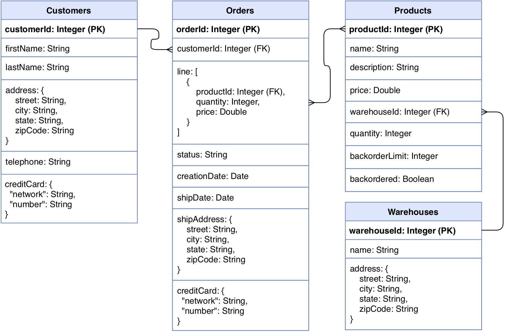

# FaunaDB: E-Commerce Tutorial

FaunaDB is a distributed database which was built to address technology requirements from modern digital businesses. One of its main features is its capability to keep strong consistency levels, typical of relational databases, while offering the the scale and flexibility of non-relational systems. Inspired by the [Calvin](http://cs.yale.edu/homes/thomson/publications/calvin-sigmod12.pdf) protocol, maintaining the integrity of transactions in a multi-region environment has been a foundation pillar from day one.

The current tutorial showcases FaunaDB correctness guarantees upon the execution of concurrent distributed transactions in the context of a E-Commerce scenario.

> For further information on the multiple consistency levels supported by FaunaDB, please visit following link: [Isolation Levels](https://docs.fauna.com/fauna/current/reference/isolation_levels.html).

##### Table of Contents
* [Prerequisites](#prerequisites)
* [Setting up](#setting-up)
  * [Create the Database](#create-the-database)
  * [Create the Schema](#create-the-schema)
  * [Create SubmitOrder function](#reate-submitorder-function) 
* [Use cases](#use-cases)
  * [1. Submit a simple Order](#1-submit-a-simple-order) 
  * [2. Submit an Order with insufficient stock](#2-submit-an-order-with-insufficient-stock) 
  * [3. Submit two Orders with insufficient stock at the same time](#3-submit-two-orders-with-insufficient-stock-at-the-same-time)
* [Conclusions](#conclusions)

## Prerequisites
In order to run the query snipptes below, you will need to setup a __Fauna Cloud__ account and install the __Fauna Shell__ in your computer. You can create a free Fauna Cloud account in seconds by signing up [here](https://dashboard.fauna.com/accounts/register). The [Fauna Shell](https://github.com/fauna/fauna-shell#fauna-shell) can be installed using [npm](https://www.npmjs.com/package/fauna-shell) or alternivately, if your on a Mac, you can use [Homebrew](https://formulae.brew.sh/formula/fauna-shell).

## Setting up
### Create the Database
The first step is to create a Database where all of the queries are going to be executed. In order to do so, login to your Fauna Cloud account using the Fauna Shell:

```
fauna cloud-login
```
It will prompt for your Fauna Cloud credentials, where you need to enter the email you used for signing up, and your password:

```
Email: email@example.com
Password: **********
```

Once you are logged in, issue the following command for creating a database called `ecommerce-tutorial`:

```
fauna create-database ecommerce-tutorial
```

Next, start a shell session for the new `ecommerce-tutorial` database with following command:

```
fauna shell ecommerce-tutorial
```

All of the query snippets going forward should be execute within a shell session.


### Create the Schema

The data model represents a simple E-Commerce domain through following classes: `Customers`, `Products`, `Warehouses` and `Orders`.

##### Data model



> A _class_ is a group of data categorized within a database. If you’re familiar with traditional databases, you can think of a class as a table without a structured schema. Data within a class usually has a common structure, but this is not required. 

FaunaDB implements a schema-free paradigm, this means no structure is provided when creating a class, but just a name for identifying it. 

For creating the classes for the E-Commerce domain, execute below queries in the shell:

```
CreateClass({name: "warehouses"});
CreateClass({name: "products"});
CreateClass({name: "customers"});
CreateClass({name: "orders"});
```

In order to access the data within the classes, we need to create a class index. An index is a database entity that allows the retrieval of instances by attributes other than their refs. A class index in this case will return all instances for a given class.

> A _reference_, or _ref_ for short, is an identifier present in every object in the database. A ref encodes the class it belongs to along with a unique id, and is therefore unique within the scope of the database in which it is stored.

Run below queries in the shell for creating the class indexes:


```
CreateIndex({"name": "all_warehouses", "source": Class("warehouses")});
CreateIndex({"name": "all_products", "source": Class("products")});
CreateIndex({"name": "all_customers", "source": Class("customers")});
CreateIndex({"name": "all_orders", "source": Class("orders")});
```

With the classes and their corresponding indexes in place, we are now able to insert and retrieve data from them.


### Insert initial data

With the schema ready it's time to insert the initial data into the dabatase. The data is inserted into classes into the form of objects called _instances_.

> Instances are single, changeable records within a FaunaDB database. If you’re familiar with other database systems, you can think of an instance as a row, record, or document.

For creating the initial instances for the `warehouses` class, execute following query in the shell:

```
Do(
  // Create Warehouse 1 instance
  Create(
    Ref(Class("warehouses"), "1"), { 
      data: { 
        "name": "East", 
        "address": { 
          "street": "13 Pierstorff Drive", 
          "city": "Washington",
          "state": "DC",
          "zipcode": "20220" 
        }
      }
    }
  ),
  // Create Warehouse 2 instance
  Create(
    Ref(Class("warehouses"), "2"), { 
      data: { 
        "name": "Central", 
        "address": {
          "street": "7529 Melrose Circle",
          "city": "Dallas",
          "zipcode": "75205",
          "state": "TX"
        }
      },
    }
  ),
  // Create Warehouse 3 instance
  Create(
    Ref(Class("warehouses"), "3"), { 
      data: { 
        "name": "Central", 
        "address": {
          "street":"4 Elka Drive",
          "city": "Tacoma",
          "zipcode": "98424",
          "state":"WA"
        },
      }
    }
  )
)
```

Issue following query in order to see the data that was inserted above:

```
Map(
  Paginate(Match(Index("all_warehouses"))),
  Lambda("nextRef", Get(Var("nextRef")))
);
```

Next, execute below query for populating the `products` class:

```
Do(
  // Create Product 1 instance
  Create(
    Ref(Class("products"), "1"), {
      data: {
        "name": "Cup",
        "description": "Translucent 9 Oz",
        "price": "6.90",
        "quantity": 100,
        "warehouseId": Ref(Class("warehouses"), "2"),
        "backorderLimit": 5,
        "backordered": false
      }
    }
  ),
  // Create Product 2 instance
  Create(
    Ref(Class("products"), "2"), {
      data: {
        "name": "Beef Cheek",
        "description": "Fresh",
        "price": "5.28",
        "quantity": 100,
        "warehouseId": Ref(Class("warehouses"), "3"),
        "backorderLimit": 10,
        "backordered": false
      }
    }
  ),
  // Create Product 3 instance
  Create(
    Ref(Class("products"), "3"), {
      data: {
        "name": "Pizza",
        "description": "Frozen Cheese",
        "price": "4.07",
        "quantity": 100,
        "warehouseId": Ref(Class("warehouses"), "1"),
        "backorderLimit": 0,
        "backordered": false
      }
    }
  )
);
```

List recently created `products` with following query:

```
Map(
  Paginate(Match(Index("all_products"))),
  Lambda("nextRef", Get(Var("nextRef")))
);
```

Last, issue below query for creating the initial `customers` instances:

```
Do(
  // Create Customer 1 instance
  Create(
    Ref(Class("customers"), "1"), { 
      data: { 
        "firstName": "Auria", 
        "lastName": "Osgardby", 
        "address": { 
          "street": "87856 Mendota Court", 
          "city": "Idaho Falls",
          "state": "ID",
          "zipcode": "83405" 
        }, 
        "telephone": "208-346-0715",
        "creditCard": {
          "network": "Visa",
          "number": "4556781272473393"
        }
      }
    }
  ),
  // Create Customer 2 instance
  Create(
    Ref(Class("customers"), "2"), { 
      data: { 
        "firstName": "Skipper", 
        "lastName": "Scanes", 
        "address": { 
          "street": "72 Waxwing Terrace", 
          "city": "Colorado Springs",
          "state": "CO",
          "zipcode": "80925" 
        }, 
        "telephone": "719-872-8799",
        "creditCard": {
          "network": "Visa",
          "number": "4916112310613672"
        }
      }
    }
  ),
  // Create Customer 3 instance
  Create(
    Ref(Class("customers"), "3"), { 
      data: { 
        "firstName": "Ardith", 
        "lastName": "Probert", 
        "address": { 
          "street": "5 Troy Trail", 
          "city": "Fairbanks",
          "state": "AK",
          "zipcode": "99790",
        }, 
        "telephone": "907-949-4470",
        "creditCard": {
          "network": "Visa",
          "number": "4532636730015542"
        }
      }
    }
  )
)
```

And retrieve all `customers` instances with below query:


```
Map(
  Paginate(Match(Index("all_customers"))),
  Lambda("nextRef", Get(Var("nextRef")))
);
```

The `orders` class will remain empty for now, instances will be created when going through the use cases coming next.

#### A word on creation flavours

It's important to notice that in the queries above we're providing a _hardcoded_ Id when creating the instances. This is being done this way in order to easily establish the relationships between the different instances in the example. If working in a real scenario, make sure to use the `NewId` function instead. The `NewId` function will generate a unique valid Id accross the entire cluster.

Moreover, it's also possible to let the `Create` function to automatically generate a valid Id for you. This can be done by providing only the `Class` part of the `Ref` object as the first argument instead. 
 
> For further information, please take a look at the documentation references for the [Create](https://docs.fauna.com/fauna/current/reference/queryapi/write/create) and [NewId](https://docs.fauna.com/fauna/current/reference/queryapi/misc/newid) functions.

### Create SubmitOrder function
As last step, let's implement a _user-defined function_ for submitting orders.

> A user-defined function accepts a set of arguments, executes a series of queries and outputs a result.
 
The `submit_order` function will ensure there's enough stock for the requested products, decrease their quantity if appropriate and create a new order. __Note that all of these operations will be executed in a transactional fashion.__

Issue below query in the shell for creating the `submit_order` function:

```
CreateFunction(
  {
    "name": "submit_order",
    "body": Query(
      Lambda(["customerId", "products"],
        // 1- Get Customer and Products
        Let(
          {
            "customer": Get(Ref(Class("customers"), Var("customerId"))),
            "products": 
              Map(
                Var("products"),
                Lambda("requestedProduct",
                  Let(
                    {
                      "product": Get(Ref(Class("products"), Select("productId", Var("requestedProduct"))))
                    },
                    {
                      "ref": Select("ref", Var("product")),
                      "price": Select(["data", "price"], Var("product")),
                      "currentQuantity": Select(["data", "quantity"], Var("product")),
                      "requestedQuantity": Select(["requestedQuantity"], Var("requestedProduct")),
                      "backorderLimit": Select(["data", "backorderLimit"], Var("product"))
                    }
                  )
                )
              )
          },
          Do(
            // 2- Check if there's enough stock
            Foreach(Var("products"),
              Lambda("product",
                If(
                  LTE(Select("requestedQuantity", Var("product")), Select("currentQuantity", Var("product"))),
                    Var("product"),
                    Abort(Concat(["Stock quantity for Product [", Select(["ref", "id"], Var("product")), "] not enough – requested at [", ToString(Time("now")), "]"]))
                )
              )
            ),
            // 3- Update products stock
            Foreach(Var("products"),
              Lambda("product",
                Update(
                  Select("ref", Var("product")), {
                    data: {
                      "quantity": Subtract(Select("currentQuantity", Var("product")), Select("requestedQuantity", Var("product")))
                    }
                  }
                )
              )
            ),
            // 4- Update backordered status
            Foreach(Var("products"),
              Lambda("product",
                If(
                  LTE(Subtract(Select("currentQuantity", Var("product")), Select("requestedQuantity", Var("product"))), Select("backorderLimit", Var("product"))),
                  Update(
                    Select("ref", Var("product")), {
                      data: {
                        "backordered": true
                      }
                    }
                  ),
                  Var("product")
                )
              )
            ),
            // 5- Create Order
            Let(
              {
                "orderProducts":
                  Map(
                    Var("products"),
                    Lambda("product", 
                      {
                        "productId": Select("ref", Var("product")),
                        "quantity": Select("requestedQuantity", Var("product")),
                        "price": Select("price", Var("product"))
                      }
                    )
                  )
              },
              Create(
                Class("orders"), {
                  data: {
                    "customerId": Select("ref", Var("customer")),
                    "line": Var("orderProducts"),
                    "status": "processing",
                    "creationDate": ToString(Time("now")),
                    "shipDate": null,
                    "shipAddress": Select(["data", "address"], Var("customer")),
                    "creditCard": Select(["data", "creditCard"], Var("customer"))
                  }
                }
              )
            )
          )
        )
      )
    )
  }
);
```

The `submit_order` function leverages many of the Fauna Query Language (FQL) features. In order to get a deeper understanding of how this function is built, please visit [FQL reference documentation](https://docs.fauna.com/fauna/current/reference/queryapi/index.html).

> While not a general-purpose programming language, FQL provides much of the functionality expected from one. It allows for complex, precise manipulation and retrieval of data stored within FaunaDB.

## Use cases
### 1. Submit a simple Order

First, we will start by submitting an Order for Products with enough stock. In order to do so, let's execute below query in the shell:

```
Call(
  Function("submit_order"), 
    "1",
    [
      Object({
        "productId": "1",
        "requestedQuantity": 10
      }),
      Object({
        "productId": "2",
        "requestedQuantity": 5
      }),
      Object({
        "productId": "3",
        "requestedQuantity": 20
      })
    ]
);
```

As all of the requested products had enough stock, upon executing above query, a new order should be created. We should see an output like the following:

```
{ 
  ref: Ref(Class("orders"), "226581909370569219"),
  ts: 1552344197540000,
  data: {
    customerId: Ref(Class("customers"), "1"),
    line: [ 
      {
        productId: Ref(Class("products"), "1"),
        quantity: 10,
        price: '6.90' 
      },
      {
        productId: Ref(Class("products"), "2"),
        quantity: 5,
        price: '5.28'
      },
      {
        productId: Ref(Class("products"), "3"),
        quantity: 20,
        price: '4.07' 
      }
    ],
    status: 'processing',
    creationDate: '2019-03-11T22:43:17.420997Z',
    shipAddress: { 
      street: '87856 Mendota Court',
      city: 'Idaho Falls',
      state: 'ID',
      zipcode: '83405'
    },
    creditCard: { 
      network: 'Visa',
      number: '4556781272473393'
    }
  }
}
```

Now if we query the `products` class index, we should also see that the products quantities have been decreased accordingly. Let's check it out by executing below query:

```
Map(
  Paginate(Match(Index("all_products"))),
  Lambda("nextRef", Get(Var("nextRef")))
);
```

We should see that the quantities have been modified:

```
{ 
  data: [ 
    {
      ref: Ref(Class("products"), "1"),
      ts: 1552344197540000,
      data: { name: 'Cup',
        description: 'Translucent 9 Oz',
        price: '6.90',
        quantity: 90,
        warehouseId: Ref(Class("warehouses"), "2"),
        backorderLimit: 5,
        backordered: false 
      } 
    },
    {
      ref: Ref(Class("products"), "2"),
      ts: 1552344197540000,
      data: { 
        name: 'Beef Cheek',
        description: 'Fresh',
        price: '5.28',
        quantity: 95,
        warehouseId: Ref(Class("warehouses"), "3"),
        backorderLimit: 10,
        backordered: false
      }
    },
    {
      ref: Ref(Class("products"), "3"),
      ts: 1552344197540000,
      data: { 
        name: 'Pizza',
        description: 'Frozen Cheese',
        price: '4.07',
        quantity: 80,
        warehouseId: Ref(Class("warehouses"), "1"),
        backorderLimit: 0,
        backordered: false
      }
    }
  ]
}
```

### 2. Submit an Order with insufficient stock

Now let's try to submit an Order for a Product which exceeds its current stock. Execute following query for doing so:

```
Call(
  Function("submit_order"), 
    "1",
    [
      Object({
        "productId": "1",
        "requestedQuantity": 150
      })
    ]
);
```

As there's not enough stock quantity for the requested product, we should see an error object containing following message:

```
'Stock quantity for Product [1] not enough – requested at [2019-03-11T23:04:18.066135Z]' 
```

### 3. Submit two Orders with insufficient stock at the same time

Last, let's try to submit two Orders for the same Product at the same time, which together exceed the current stock. There will be enough stock only for one of the two Orders, this means one of them should succeed and the other should fail.

> In order to go through this use case in the most realistic way possible, you will need to be able to simulate two different users running a query at the same time. This could be done by executing the corresponding queries simlutanesoly in two different terminal windows in one single computer. Please check the documentation of your terminal of choice on how to run two commands in different windows at the same time.

In one terminal window, prepare below query:

```
Call(
  Function("submit_order"), 
    "1",
    [
      Object({
        "productId": "1",
        "requestedQuantity": 70
      })
    ]
);
```

And in another terminal, copy following query:

```
Call(
  Function("submit_order"), 
    "2",
    [
      Object({
        "productId": "1",
        "requestedQuantity": 50
      })
    ]
);
```

Then execute both of them at the same time. 

As result you should see in one of the terminals that the Order has been created successfully:


```
{ 
  ref: Ref(Class("orders"), "226581909370569219"),
  ts: 1552344197540000,
  data: {
    customerId: Ref(Class("customers"), "1"),
    line: [ 
      {
        productId: Ref(Class("products"), "1"),
        quantity: 70,
        price: '6.90' 
      }
    ],
    status: 'processing',
    creationDate: '2019-03-11T22:43:17.420997Z',
    shipAddress: { 
      street: '87856 Mendota Court',
      city: 'Idaho Falls',
      state: 'ID',
      zipcode: '83405'
    },
    creditCard: { 
      network: 'Visa',
      number: '4556781272473393'
    }
  }
}
```

And in the other, an error message saying there's not enough stock for perfoming the operation:

```
'Stock quantity for Product [1] not enough – requested at [2019-03-11T22:43:17.066135Z]' 
```

If you look closer at the Order `creationDate` and the time prompted in the error message, you will find that both time values differ only by fraction of seconds. This demonstrates that despite being executed at the same time, the two queries have been effectively being processed in a serialized way and only one of them has managed to modifiy the records stored in the database.

## Conclusions